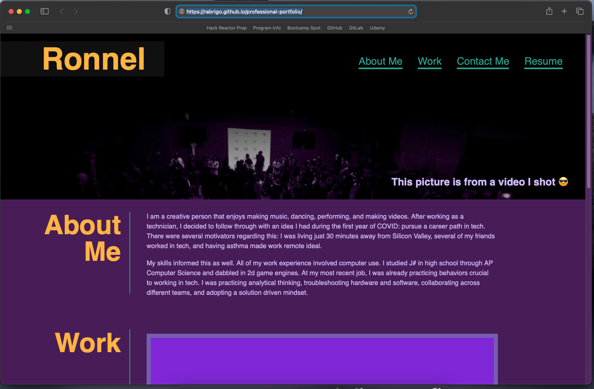
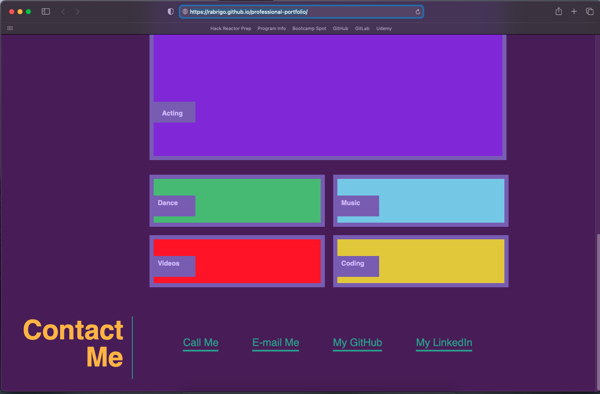

# Professional-Portfolio-Assignment

## Description:

This is one of our Week 2 homework assignments and combines several of the concepts
covered thus far: semantic HTML tags, CSS (selectors, attributes, classes, and ID's), responsive design, and pseudo classes to name a few.

I put Google Chrome dev tools into good use to determine how parts of my HTML code
were being affected by CSS. When I saw my CSS code wasn't taking effect, I would select the selector tool and hover over the item and see if the styling was showing up.

I was able to successfully get flex boxes to work. This took a lot of trial error and I even created a separate project to things out. Once I started seeing repetition in my code, I refactored it by listing multiple classes for common attributes. 

In the future, I would like to revisit this and add the following:
-Internet fonts
-actual links to work
-background images to the portfolio boxes
-Highlighting to underline of links
-Refactor the code further

## Installation:

My portfolio website has been uploaded as a repo to my GitHub. 
You can view it here: https://rabrigo.github.io/professional-portfolio/

### Credits:

colorhunt.co for the inspiration for the color palette!
Posts on Stack Overflow helped me troubleshoot pseudo classes.